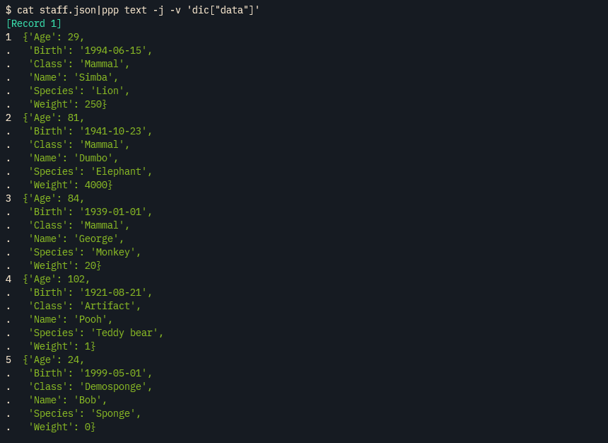

# pypipe <!-- omit from toc -->

```sh
$ echo "pypipe" | ppp "line[::2]"
ppp
```

**pypipe** is a Python command-line tool for pipeline processing.

## Demo <!-- omit from toc -->


## Quick links <!-- omit from toc -->
- [Installation](#installation)
- [Basic usage and Examples](#basic-usage-and-examples)
- [View mode `-v, --view`](#view-mode--v---view)
- [Output formatting](#output-formatting)
- [Counter `-c, --counter`](#counter--c---counter)
- [pypipe is a code generator.](#pypipe-is-a-code-generator)
- [Pager](#pager)


## Installation
pypipe is a single Python file and uses only the standard library. You can use it by placing `pypipe.py` in a directory included in your PATH (e.g., ~/.local/bin). If execute permission is not already present, please add it.
```sh
chmod +x pypipe.py
```
To make it easier to type, it's recommended to create a symbolic link.
```sh
ln -s pypipe.py ppp
```

> **Note**
> pypipe requires Python 3.6 or later.

pypipe can also be installed in the standard way for Python packages, using [pip](https://pip.pypa.io/en/stable/) or any compatible tool such as [pipx](https://pypa.github.io/pipx/).
```sh
pipx install pypipe-ppp
```
It also supports running directly with pipx without installation.
```sh
pipx run pypipe-ppp <args>
```

You can also use it with [Wasmer](https://wasmer.io/):
```sh
alias ppp="wasmer run bugen/pypipe -- "
```

## Basic usage and Examples

### `| ppp line`

Processing line by line. You can get the line string as `line` or `l` and the line number as `i`.

```sh
$ cat staff.txt |ppp 'i, line.upper()'
1       NAME    WEIGHT  BIRTH   AGE     SPECIES CLASS
2       SIMBA   250     1994-06-15      29      LION    MAMMAL
3       DUMBO   4000    1941-10-23      81      ELEPHANT        MAMMAL
4       GEORGE  20      1939-01-01      84      MONKEY  MAMMAL
5       POOH    1       1921-08-21      102     TEDDY BEAR      ARTIFACT
6       BOB     0       1999-05-01      24      SPONGE  DEMOSPONGE
```

Using the `-j, --json` option allows you to decode each line as JSON. The decoded result can be obtained as a dictionary `dic`.
```sh
$ cat staff.jsonlines.txt |ppp -j 'dic["Name"]'
Simba
Dumbo
George
Pooh
Bob
```

### `| ppp rec`

Split each line by TAB. You can get the list including splitted strings as `rec` or `r` and the record number as `i`..
```sh
cat staff.txt |ppp rec 'r[:3]'
Name    Weight  Birth
Simba   250     1994-06-15
Dumbo   4000    1941-10-23
George  20      1939-01-01
Pooh    1       1921-08-21
Bob     0       1999-05-01
```

Using the `-l LENGTH, --length LENGTH` option allows you to get the values of each field as `f1, f2, f3, ....`
```sh
$ tail -n +2 staff.txt |ppp rec -l5 'f"{f1} is {f4} years old"'
Simba is 29 years old
Dumbo is 81 years old
George is 84 years old
Pooh is 102 years old
Bob is 24 years old
```

When using the `-H, --header` option, it treats the first line as a header line and skips it. The header values can be obtained from a list named `header`, and you can access the values of each field using the format `dic["FIELD_NAME"]`.
```sh
$ cat staff.txt |ppp rec -H 'rec[0], dic["Birth"]'
Simba   1994-06-15
Dumbo   1941-10-23
George  1939-01-01
Pooh    1921-08-21
Bob     1999-05-01
```

By using the `-t FIELD_TYPES, --field-type FIELD_TYPES`, you can specify the type of each field, allowing you to convert values from 'str' to the specified type.
```sh
$ echo 'Hello	100	10.2	True	{"id":100,"title":"sample"}'|ppp rec -l5 -t 2:i,3:f,4:b,5:j "type(f1),type(f2),type(f3),type(f4),type(f5)"
<class 'str'>   <class 'int'>   <class 'float'> <class 'bool'>  <class 'dict'>
```
> **Note**
> When there is a header row in the data, using `-t` often results in errors when attempting to convert the header row's item names to the specified types. In such cases, you can avoid errors by using the `-H, --header` option to skip the header row.

You can change the delimiter by using the `-d DELIMITER, --delimiter DELIMITER` option.
```sh
$ cat staff.csv |ppp rec -d , -l6  f1
Name
Simba
Dumbo
George
Pooh
Bob
```

Also supports regular expression delimiters.

```sh
$ echo 'AAA      BBB CCC    DDD' | ppp rec -d '\s+' rec[2]
CCC
```

> **Note**
> `-S, --spaces` option has the same meaning as `-d '\s+'`.

You can change the output delimiter by using the `-D DELIMITER, --output-delimiter DELIMITER` option.
```sh
$ cat staff.txt |ppp rec -D ,
Name,Weight,Birth,Age,Species,Class
Simba,250,1994-06-15,29,Lion,Mammal
Dumbo,4000,1941-10-23,81,Elephant,Mammal
George,20,1939-01-01,84,Monkey,Mammal
Pooh,1,1921-08-21,102,Teddy bear,Artifact
Bob,0,1999-05-01,24,Sponge,Demosponge
```

When using the `-m, --regex-match` option, `rec` is generated through regular expression matching instead of delimiter-based splitting.
```sh
$ echo 'Height: 200px, Width: 1000px' | ppp rec -m '\d+' r[1]
1000
```

### `| ppp csv`
`csv` is similar to `rec`, but the difference is that while `rec` simply splits the line using the specified DELIMITER like this, `'line.split(DELIMITER))'`, `csv` uses the [csv](https://docs.python.org/3/library/csv.html) library for parsing. Furthermore, `rec` is tab-separated by default, whereas `csv` is comma-separated.

You can specify options to pass to csv.reader and csv.writer using the `-O NAME=VALUE, --csv-opt NAME=VALUE` option.
```sh
$ cat staff.csv |ppp csv -O 'quoting=csv.QUOTE_ALL'
"Name","Weight","Birth","Age","Species","Class"
"Simba","250","1994-06-15","29","Lion","Mammal"
"Dumbo","4000","1941-10-23","81","Elephant","Mammal"
"George","20","1939-01-01","84","Monkey","Mammal"
"Pooh","1","1921-08-21","102","Teddy bear","Artifact"
"Bob","0","1999-05-01","24","Sponge","Demosponge"
```


### `| ppp text`
In `ppp text`, the entire standard input is read as a single piece of text. You can access the read text as `text`.

```sh
$ cat staff.txt | ppp text 'len(text)'
231
```

For example, `ppp text` is particularly useful when working with an indented JSON file. Using the `-j, --json` option allows you to decode the text into JSON. The decoded data can be obtained as a `dic`.
```sh
$ cat staff.json |ppp text -j 'dic["data"][0]'
{'Name': 'Simba', 'Weight': 250, 'Birth': '1994-06-15', 'Age': 29, 'Species': 'Lion', 'Class': 'Mammal'}
```

> **Note**
> You can also use `-j, --json` option in `line` and `file`.

### `| ppp file`
In `ppp file`, it receives a list of file paths from standard input. It then opens each received file path, reads the contents of the file into `text`, and repeats this process for each received file path in a loop. The received paths can be obtained as `path`.

```sh
$ ls staff.txt staff.csv staff.json staff.xml |ppp file 'path, len(text)'
staff.csv       231
staff.json      1046
staff.txt       231
staff.xml       1042
```

For example, `ppp file` is useful, especially when processing a large number of JSON files.
```sh
find . -name '*.json'| ppp file --json ...
```

### `| ppp custom -N NAME`
You can easily create custom commands using pypipe. First, you define custom commands. The definition file is, by default, located at `~/.config/pypipe/pypipe_custom.py`. You can change the path of this file using the `PYPIPE_CUSTOM` environment variable.

The following is an example of defining custom commands xpath and sum.

~/.config/pypipe/pypipe_custom.py
```python
TEMPLATE_XPATH = r"""
from lxml import etree
{imp}

def output(e):
    if isinstance(e, etree._Element):
        print(etree.tostring(e).decode().rstrip())
    else:
        _print(e)

{pre}

tree = etree.parse(sys.stdin)
for e in tree.xpath('{path}'):
{loop_head}
{loop_filter}
{main}

{post}
"""

TEMPLATE_SUM = r"""
import re
import sys
{imp}

ptn = re.compile(r'{pattern}')
s = 0

def add_or_print(*args):
    global s
    rec = args[0]
    if len(args) == 2:
        if isinstance(args[1], int):
            i = args[1]
            if len(rec) >= i:
                s += rec[i-1]
        else:
            print(args[1])
    else:
        print(*args[1:])


for line in sys.stdin:
    line = line.rstrip('\r\n')
    rec = [{type}(e) for e in ptn.findall(line)]
    if not rec:
        continue
{loop_head}
{loop_filter}
{main}

print(s)
"""

custom_command = {
    "xpath": {
        "template": TEMPLATE_XPATH,
        "code_indent": 1,
        "default_code": "e",
        "wrapper": 'output({})',
        "options": {
            "path": {"default": '/'}
        }
    },
    "sum": {
        "template": TEMPLATE_SUM,
        "code_indent": 1,
        "default_code": "1",
        "wrapper": 'add_or_print(rec, {})',
        "options": {
            "pattern": {"default": r'\d+'},
            "type": {"default": 'int'}
        }
    },
}
```

You can use them as follows:

```sh
$ cat staff.xml |ppp custom -N xpath -O path='./Animal/Age'
<Age>29</Age>
<Age>81</Age>
<Age>84</Age>
<Age>102</Age>
<Age>24</Age>
```

```sh
$ seq 10000| ppp c -Nsum -f 'rec[0] % 3 == 0'
16668333
```

## View mode `-v, --view`
When using the `-v, --view` option, the output is pretty printed with colored formatting. Data formats with many items such as CSV, TSV, JSON, and others can be hard to read in their raw format, making the View mode particularly useful when inspecting such data. In View mode, `dict`, `list` and `tuple` are formatted using the standard library's `pprint`.


When you use both the `-v, --view` option and the `-H, --header` option together, it displays the values along with the field names.


In View mode, `dict`, `list` and `tuple` are formatted using the standard library's `pprint`.




### `-k COLOR_MODE, --color COLOR_MODE`
In View mode, pypipe automatically determines whether to apply colorization. By default, when outputting to a terminal, the output will be in color. However, if you redirect the output to a file or pipe it to another command, it will not be in color. You can change this behavior using the `-k COLOR_MODE, --color COLOR_MODE` options:

- Using `-k auto` or `--color auto` lets the tool automatically decide whether to apply colorization.
- Using `-k always` or `--color always` forces colorization at all times.
- Using `-k never` or `--color never` disables colorization.

## Output formatting
In pypipe, you have the flexibility to write code to output results in any desired format. For example:

```sh
$ echo "Hello" | ppp line -n 'print(line + " World!")'
Hello World!
```

Please note the presence of the `-n` option in the command above. If you omit this option, the output will look like this:

```sh
$ echo "Hello" | ppp line 'print(line + " World!")'
Hello World!
None
```

So, what's happening here? When you have questions about pypipe's behavior, a good approach is to inspect the code generated using the `-p, --print` option.

```sh
~$ echo "Hello" | ppp line  'print(line + " World!")' -p
# IMPORT
import sys
from functools import partial

# PRE
_p = partial(print, sep="\t")  # ABBREV
I, S, B, L, D, SET = 0, "", False, [], {}, set()  # ABBREV

def _print(*args, sep='\t'):
    if len(args) == 1 and isinstance(args[0], (list, tuple)):
        print(sep.join(str(v) for v in args[0]))
    else:
        print(sep.join(str(v) for v in args))


for i, line in enumerate(sys.stdin, 1):
    line = line.rstrip("\r\n")
    l = line  # ABBREV
    # LOOP HEAD
    # LOOP FILTER
    # MAIN
    _print(print(line + " World!"))

# POST
```

In this case, running `ppp line 'print(line + " World!")' -p` should reveal a line in the generated code like `_print(print(line + " World!"))`. This is due to a unique feature of pypipe called as [Code wrapping](#code-wrappping).

Let's make a slight modification to the command by removing the print function:

```sh
$ echo "Hello" | ppp line 'line + " World!"'
Hello World!
```

Indeed, pypipe is designed to allow the omission of the print function for less typing.

### Change the behavior of the `_print` function
By default, the `_print({})` wrapper is used. The `_print` function is an internally implemented output function in pypipe and has the following implementation:

```python
def _print(*args, sep='\t'):
    if len(args) is 1 and isinstance(args[0], (list, tuple)):
        print(sep.join(str(v) for v in args[0]))
    else:
        print(sep.join(str(v) for v in args))
```
You can replace the implementation of the _print function using the `-F FORMAT, --output-format FORMAT` option. pypipe allows you to control the output format by changing the implementation of the _print function.

#### `-Fd, -F default, --output-format=default`
Default output format.

Implementation of the _print function: as described above.

Output example:
```sh
$ echo '["aaa", "bbb", "ccc"]' | ppp --json -Fd dic
aaa	bbb	ccc
```

#### `-Fj, -F json, --output-format=json`
Converts `dict`, `list`, and `tuple` to JSON format for output. However, when a single string is passed, it will not be enclosed in double quotes (meaning it is not in JSON string format).

Implementation of the `_print` function:
```python
def _json(v):
    if isinstance(v, (dict, list, tuple)):
        v = json.dumps(v)
    elif not isinstance(v, str):
        v = str(v)
    return v

def _print(*args, sep='\t'):
    print(sep.join(_json(v) for v in args))
```

Output example:

```sh
$ echo '["aaa", "bbb", "ccc"]' | ppp --json -Fj dic
["aaa", "bbb", "ccc"]
```

#### `-Fn, -F native, --output-format=native`
Uses the standard print function for output.

Implementation of the `_print` function:
```python
_print = partial(print, sep='\t')
```

Output example:
```sh
$ echo '["aaa", "bbb", "ccc"]' | ppp --json -Fn dic
['aaa', 'bbb', 'ccc']

```

### Change the output delimiter `-D DELIMITER, --output-delimiter DELIMITER`
You can change the output delimiter using the `-D DELIMITER, --output-delimiter DELIMITER` option. The delimiter does not have to be a single character, you can specify multiple characters [^1].

```sh
$ cat staff.txt | ppp rec -D ' | '
Name | Weight | Birth | Age | Species | Class
Simba | 250 | 1994-06-15 | 29 | Lion | Mammal
Dumbo | 4000 | 1941-10-23 | 81 | Elephant | Mammal
George | 20 | 1939-01-01 | 84 | Monkey | Mammal
Pooh | 1 | 1921-08-21 | 102 | Teddy bear | Artifact
Bob | 0 | 1999-05-01 | 24 | Sponge | Demosponge
```

[^1]: Internally, the character specified using the `-D, --output-delimiter` option is passed as the `sep` argument to the `_print` function. Then, you can specify multiple characters for `sep`. However, it's important to note that in the `csv` command, a different output function using `csv.writer` is used as a wrapper, rather than the `_print` function. In this case, the character specified using the `-D, --output-delimiter` option is passed as the `delimiter` argument to `csv.writer`, and specifying multiple characters for the delimiter is not possible.

#### `-L, --linebreak`
The `-L, --linebreak` option has the same meaning as `-D '\n', --output-delimiter '\n'`. It is useful when connecting pypipe's output to pypipe. Instead of writing a for loop in pypipe, you can use `-L, --linebreak` to connect to the next pypipe, enabling you to achieve similar processing as nested for loops.

Using `-L` to output with line breaks:
```sh
$ cat staff.json|ppp text -j '*dic["data"]' -Fj -L
{"Name": "Simba", "Weight": 250, "Birth": "1994-06-15", "Age": 29, "Species": "Lion", "Class": "Mammal"}
{"Name": "Dumbo", "Weight": 4000, "Birth": "1941-10-23", "Age": 81, "Species": "Elephant", "Class": "Mammal"}
{"Name": "George", "Weight": 20, "Birth": "1939-01-01", "Age": 84, "Species": "Monkey", "Class": "Mammal"}
{"Name": "Pooh", "Weight": 1, "Birth": "1921-08-21", "Age": 102, "Species": "Teddy bear", "Class": "Artifact"}
{"Name": "Bob", "Weight": 0, "Birth": "1999-05-01", "Age": 24, "Species": "Sponge", "Class": "Demosponge"}
```
To further process this output:

```sh
$ cat staff.json | ppp text -j '*dic["data"]' -Fj -L | ppp -j 'dic["Weight"]' | ppp c -N sum
4271
```

This can also be written as follows. Please use your preferred method:
```sh
$ cat staff.json|ppp text -j '
> for r in dic["data"]:
>     I += r["Weight"]
> ' -n -a 'print(I)'
4271
```
## Counter `-c, --counter`
Using the `-c, --counter` option allows for easy data aggregation. When you specify the `-c, --counter` option, it creates an instance of collections.Counter, which can be accessed as either `counter` or `c`. The `-c, --counter` option is available for use in all commands.

An example of aggregating data by the 'Gender' and 'Hobby' fields.
```sh
$ cat people.csv |ppp csv -H --counter 'dic["Gender"], dic["Hobby"]'| head -n10
Female  Cooking 4
Male    Hiking  3
Female  Reading 3
Male    Gardening       3
Female  Traveling       3
Male    Playing Music   3
Female  Dancing 3
Female  Hiking  3
Female  Painting        2
Male    Photography     2
```

This is an example to aggregate data based on whether female individuals are 30 years or older.
```sh
cat people.csv |ppp csv -H -c -f 'dic["Gender"] == "Female"' 'int(dic["Age"]) >= 30'
False   16
True    10
```

When using the `-c, --counter` option, it uses `counter[{}] += 1` as the wrapper. If you want to count in a different way, you can disable the wrapping by using the `-n, --no-wrapping` option and add your own counting code.

```sh
$ cat population.csv |ppp csv -H -c -n 'counter[dic["State"]] += int(dic["Population"])'
New York        8398748
Texas   7751480
California      7327731
Illinois        2705994
Arizona 1680992
Pennsylvania    1584138
Florida 903889
Ohio    892533
Indiana 876862
North Carolina  792862
Washington      753675
Michigan        673104
```

Information about [Code wrapping](#code-wrapping).


## pypipe is a code generator.
pypipe is a command-line tool for pipeline processing, but it can also be thought of as a code generator. It generates code internally using the given arguments and then executes the generated code using the `exec` function. Therefore, instead of executing the generated code, you have the option to print it to the standard output or save it to a file.

### Print generated code. `-p, --print`
To check the generated code, you can use the `-p, --print` option.
```sh
ppp file -m rb -i hashlib -b 'total = 0' -b '_p("PATH", "SIZE", "MD5")' -e 'size = len(text)' -f 'path.stem == "staff"' 'total += size' 'path, size, hashlib.md5(text).hexdigest()' -a 'print(f"Total size: {total}")' -p
```
The generated code is output as follows.
```python
# IMPORT
import sys
from functools import partial
import gzip
from pathlib import Path
import hashlib

def _open(path):
    if path.suffix == '.gz':
        return gzip.open(path, 'rb')
    else:
        return open(path, 'rb')

# PRE
_p = partial(print, sep="\t")  # ABBREV
I, S, B, L, D, SET = 0, "", False, [], {}, set()  # ABBREV

def _print(*args, sep='\t'):
    if len(args) == 1 and isinstance(args[0], (list, tuple)):
        print(sep.join(str(v) for v in args[0]))
    else:
        print(sep.join(str(v) for v in args))

total = 0
_p("PATH", "SIZE", "MD5")

for i, line in enumerate(sys.stdin, 1):
    path = Path(line.rstrip('\r\n'))
    with _open(path) as file:
        text = file.read()
        # LOOP HEAD
        size = len(text)
        # LOOP FILTER
        if not (path.stem == "staff"): continue
        # MAIN
        total += size
        _print(path, size, hashlib.md5(text).hexdigest())

# POST
print(f"Total size: {total}", file=sys.stderr)
```

Check that there are no issues with the generated code and execute it.
```sh
$ find docs -type f |ppp file -m rb -i hashlib -b 'total = 0' -b '_p("PATH", "SIZE", "MD5")' -e 'size = len(text)' -f 'path.stem == "staff"' 'total += size' 'path, size, hashlib.md5(text).hexdigest()' -a 'print(f"Total size: {total}")'
PATH    SIZE    MD5
docs/staff.json 1046    3f81986424eea2648bcabec324f8e959
docs/staff.txt  231     a0757fb3838ed1235b21f96e1953445c
docs/staff.xml  1042    7d36d493c1dd7594db3426f242b667f6
docs/staff.csv  231     6cba6414c49b8762d6a49e2d9a62e563
Total size: 2550
```

### Save generated code to a file. `-o PATH, --output PATH`
For writing more complex code, it's a good practice to create a template code with pypipe and edit the templated code manually. Here's the process you can follow:

1.  Create a template code with pypipe and save it to a file, for example:
    ```sh
    ppp line --output /tmp/pipe.py ...
    ```
2. Edit the code in /tmp/pipe.py to suit your needs.
3. Execute the modified code by piping input to it, for example:
   ```sh
   cat sample.txt | /tmp/pipe.py
   ```

### Main codes
The main code is specified as positional arguments. You can specify multiple main codes. The placement of the main code varies depending on the command. In commands like `line`, `rec`, `csv`, and `file`, the main code is added within the loop processing with proper indentation. However, in the `text` command, where there is no loop processing, the main code is added without indentation.
In the `custom` command, the main code is added according to the definitions provided in the `pypipe_custom.py` file.

```sh
$ ppp text -pqrn "for word in text.split():"  "    print(word)"
```
```python
import sys
from functools import partial

def _print(*args, sep='\t'):
    if len(args) == 1 and isinstance(args[0], (list, tuple)):
        print(sep.join(str(v) for v in args[0]))
    else:
        print(sep.join(str(v) for v in args))

text = sys.stdin.read()
for word in text.split():  # <- HERE
    print(word)            # <- HERE
```

You can also write it with line breaks in the terminal as follows:
```sh
$ ppp text -pqrn '
> for word in text.split():
>     print(word)
> '
```


### Default main code
If no main code is specified in the arguments, pypipe adds a predefined default code. For example, the default code in Line mode is `'line'`.
```sh
ppp -pqr
```
```python
import sys
from functools import partial


def _print(*args, sep='\t'):
    if len(args) == 1 and isinstance(args[0], (list, tuple)):
        print(sep.join(str(v) for v in args[0]))
    else:
        print(sep.join(str(v) for v in args))


for i, line in enumerate(sys.stdin, 1):
    line = line.rstrip("\r\n")
    _print(line)   # Default code with code wrappping.
```

### Code wrapping
By default, pypipe wraps the last code specified in the arguments with a predefined wrapper. For example, in `ppp line`, it uses `'_print({})'` as the wrapper. However, if the `-c, --counter` option is specified, it uses `'counter[{}] += 1'` as the wrapper instead.
```sh
$ ppp line 'year = int(line)' year -pqr
```
```python
import sys
from functools import partial


def _print(*args, sep='\t'):
    if len(args) == 1 and isinstance(args[0], (list, tuple)):
        print(sep.join(str(v) for v in args[0]))
    else:
        print(sep.join(str(v) for v in args))


for i, line in enumerate(sys.stdin, 1):
    line = line.rstrip("\r\n")
    year = int(line)
    _print(year)  # Wrapping
```
#### Disable code wrapping. `-n, --no-wrapping`
If you want to disable the wrapping of the last code specified in the arguments by a predefined wrapper, you can use the `-n, --no-wrapping` option.
```sh
$ ppp line -n 'I = max(len(line), I)' -a 'print(I)' -pq
```
```python
import sys
from functools import partial

_p = partial(print, sep="\t")  # ABBREV
I, S, B, L, D, SET = 0, "", False, [], {}, set()  # ABBREV

def _print(*args, sep='\t'):
    if len(args) == 1 and isinstance(args[0], (list, tuple)):
        print(sep.join(str(v) for v in args[0]))
    else:
        print(sep.join(str(v) for v in args))


for i, line in enumerate(sys.stdin, 1):
    line = line.rstrip("\r\n")
    l = line  # ABBREV
    I = max(len(line), I)   # No wrapping

print(I)
```

### Pre and Post codes. `-b CODE, --pre CODE`,  `-a CODE, --post CODE`
The code specified with `-b CODE, --pre CODE` will be added before the loop processing or the main code. This can be useful for declaring variables or performing any necessary setup before entering a loop or executing the main code. The code specified with `-a CODE, --post CODE` will be added after the loop processing or the main code. This can be useful for displaying aggregated results or performing any additional actions after the loop or main code execution.

```sh
$ ppp rec --pqrn -b 'TOTAL = 0' -b 'MAX = 0'  'TOTAL += int(rec[0])' 'MAX = max(MAX, int(rec[0]))'  -a 'print(f"TOTAL: {TOTAL}")' -a 'print(f"MAX: {MAX}")'
```
```python
import sys
from functools import partial


def _print(*args, sep='\t'):
    if len(args) == 1 and isinstance(args[0], (list, tuple)):
        print(sep.join(str(v) for v in args[0]))
    else:
        print(sep.join(str(v) for v in args))


TOTAL = 0   # PRE
MAX = 0     # PRE

for i, line in enumerate(sys.stdin, 1):
    line = line.rstrip("\r\n")
    rec = line.split('\t')
    TOTAL += int(rec[0])
    MAX = max(MAX, int(rec[0]))

print(f"TOTAL: {TOTAL}")  # POST
print(f"MAX: {MAX}")      # POST
```

### Inner loop. `-e CODE, --loop-head CODE`, `-f CODE, --filter CODE`
In the loop processing of `line`, `rec`, `csv`, and `file` commands, the code is added in the following positions:
```
for ... :
    {loop_head}  # Added with the -e CODE, --loop-head CODE option.
    {filter}     # Added with the -f CODE, --filter CODE option.
    {main}       # The main code is added here.
```
"loop_head" is added using the `-e CODE, --loop-head CODE` option, while "filter" is added using the `-f CODE, --filter CODE` option.
Please note that the "loop_head" code is added as-is, while the "loop_filter" is wrapped with `if not ({}): continue`.

```sh
$ ppp line -pqrn -e 'line = line.replace("foo", "bar")' -e 'line = line.upper()' -f '"BAR" in line' 'print(line)'
```
```python
import sys
from functools import partial


def _print(*args, sep='\t'):
    if len(args) == 1 and isinstance(args[0], (list, tuple)):
        print(sep.join(str(v) for v in args[0]))
    else:
        print(sep.join(str(v) for v in args))


for i, line in enumerate(sys.stdin, 1):
    line = line.rstrip("\r\n")
    line = line.replace("foo", "bar")  # LOOP_HEAD
    line = line.upper()                # LOOP_HEAD
    if not ("BAR" in line): continue   # FILTER
    print(line)                        # MAIN
```

### Import modules. `-i MODULE, --import MODULE`

By using the `-i MODULE, --import MODULE` option, you can import any modules. If the value specified with `--import` is in the form of a sentence, like `import math` or `from math import sqrt`, it will be added as an import statement just as it is. If only the module name is provided, like `math`, it will automatically be given an import statement, such as `import math`.

ppp text -i zlib -i 'from base64 import b64encode' 'b64encode(zlib.compress(text.encode()))'

```sh
$ ppp text -pqrn -i zlib -i 'from base64 import b64encode' 'print(b64encode(zlib.compress(text.encode())))'
```
```python
import sys
from functools import partial
import zlib                    # <- HERE
from base64 import b64encode   # <- HERE

def _print(*args, sep='\t'):
    if len(args) == 1 and isinstance(args[0], (list, tuple)):
        print(sep.join(str(v) for v in args[0]))
    else:
        print(sep.join(str(v) for v in args))


text = sys.stdin.read()
print(b64encode(zlib.compress(text.encode())))
```

Usage example.
```sh
$ seq 5 |ppp -i math 'line, math.sqrt(int(line))'
1       1.0
2       1.4142135623730951
3       1.7320508075688772
4       2.0
5       2.23606797749979
```

## Pager
pypipe, by default, pipes the output to a pager. The default pager command is `less -R -F -K` (recommended, tested). If you want to disable the pager, you can set the `PYPIPE_PAGER_ENABLED` environment variable to `false`. Additionally, you can change the pager command by setting the `PYPIPE_PAGER` environment variable.

<!-- ## Misc

### pypipe only supports standard input.
pypipe only supports standard input. You cannot specify input files as arguments, and there are no plans to implement this option. pypipe follows a policy of keeping the implementation as simple as possible and avoiding dependencies on libraries outside the standard library. Supporting input files would make the implementation more complex and increase the code size, which goes against this policy. For most use cases, input from standard input should be sufficient. If you need functionalities like rewind or seek, it's better to write plain Python code without using pypipe. If you strongly prefer not to connect through pipes, you can kind of get the feel of specifying an input file using redirection like this (+_+)!:
```sh
ppp line ... <input.txt
```

### Performance
pypipe prioritizes ease of use and doesn't focus on high performance (as Python itself is not particularly fast). If you require high performance, it's advisable to use other excellent commands like [awk](https://www.gnu.org/software/gawk/manual/gawk.html). -->
